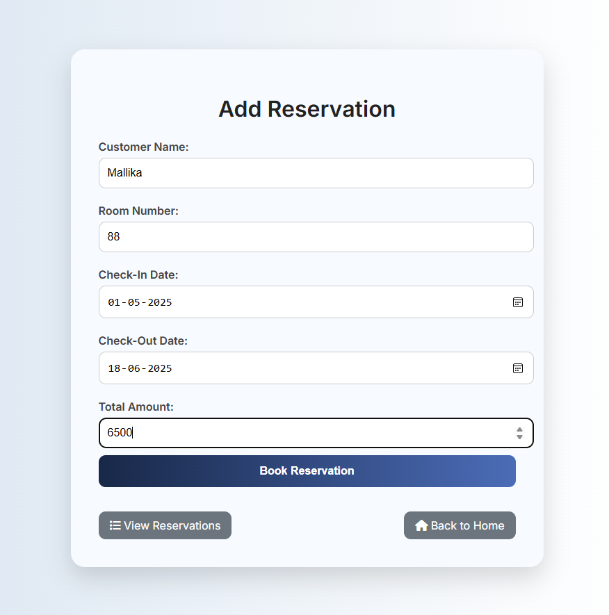
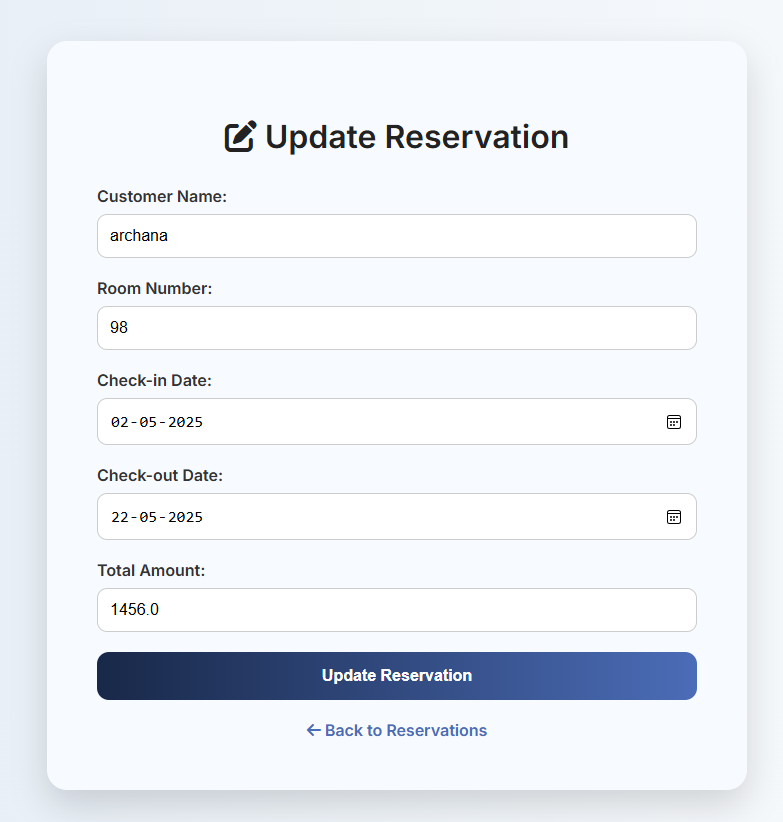
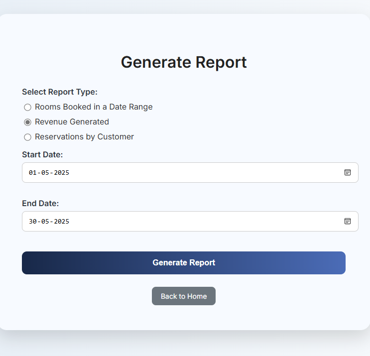
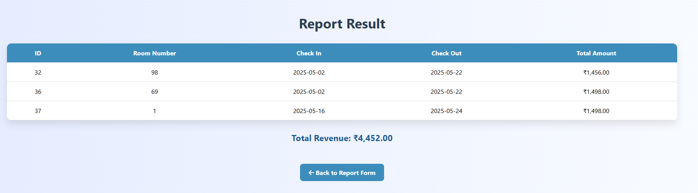

# 🏨 Hotel Management System

**Subject Name**: Advanced Java  
**Subject Code**: BCS613D  
**Name**: Mallika K 
**USN**: 4AL22CS083  
**Semester/Section**: VI / B  

A comprehensive web-based Hotel Management System for managing hotel room reservations, customers, and revenue reports. Built using **JSP**, **Servlets**, and **MySQL**, the application follows **MVC architecture** and supports essential CRUD operations, reporting, and data filtering.

---

## 🚀 Features

- **CRUD Operations**: Add, Update, Delete, and Display Reservations  
- **Reports Module**:  
  - Rooms booked in a date range  
  - Total Revenue for a selected date range  
  - Customer-wise reservations within a date range  
- **Validation**:  
  - Form input validation for dates and required fields  
- **Responsive UI**: Clean and user-friendly interface  
- **MVC Pattern**: JSP + Servlet + JDBC architecture  
- **MySQL Integration**: Structured and scalable schema  

---

## 📋 Prerequisites

Ensure the following tools are installed:

- JDK 8 or later  
- Apache Tomcat 9+  
- MySQL or XAMPP Server  
- MySQL Connector/J (JDBC Driver)  
- Eclipse (or any Java IDE)  
- Modern Web Browser (Chrome / Edge / Firefox)  

---

## 🗄️ Database Setup

### 1. Create the Database

CREATE DATABASE IF NOT EXISTS hotel_management;
USE hotel_management;

## 2. Create the Table

CREATE TABLE IF NOT EXISTS Reservations (
    reservationId INT PRIMARY KEY AUTO_INCREMENT,
    customerName VARCHAR(100) NOT NULL,
    roomNumber INT NOT NULL,
    checkIn DATE NOT NULL,
    checkOut DATE NOT NULL,
    totalAmount DOUBLE NOT NULL
);

## 3. Insert Sample Data

INSERT INTO Reservations (customerName, roomNumber, checkIn, checkOut, totalAmount) VALUES
('Mallika K Gowda', 101, '2025-05-10', '2025-05-12', 2500.00),

---

## 📸 Sample Outputs

### 🧾 Add Reservation Page

### 📋 View Reservations

### 📋 Update Reservations

### 📈 Revenue Report

---

## 🎓 Learning Outcomes
✨ Practical experience with JSP, Servlets, JDBC

🧱 Implemented real-world MVC structure

📊 Built reporting modules with filters

✅ Hands-on with form validation, SQL operations, and deployment
